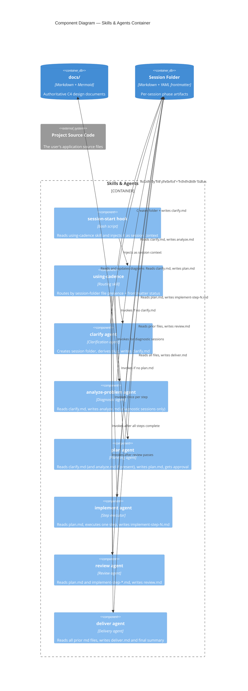

# cadence Plugin — Components

> **Type**: C4 Component
> **Last Updated**: 2026-05-03
> **Covers**: Internal components of the Skills & Agents container

## Diagram

## Key Decisions

- `using-cadence` is the single entry point — all routing decisions live here, not in individual agents
- Workflow state lives in the session folder as one md file per phase (with YAML frontmatter), not in conversation context — this enables resume after interruption (from plan: cadence-session-folders)
- Every phase (clarify, analyze, plan, implement, review, deliver) is a writer to the session folder; downstream phases read prior files instead of inlined context (from plan: cadence-session-folders)
- Subagents return one-line `(path, summary)` handoffs; the file is the contract, the return message is the pointer (from plan: cadence-session-folders)

## Notes

- See `c4-containers.md` for the container-level view
- See `c4-seq-execution.md` for the runtime interaction sequence
- `hooks/run-hook.cmd` and `hooks/hooks.json` wire the SessionStart hook into Claude Code
