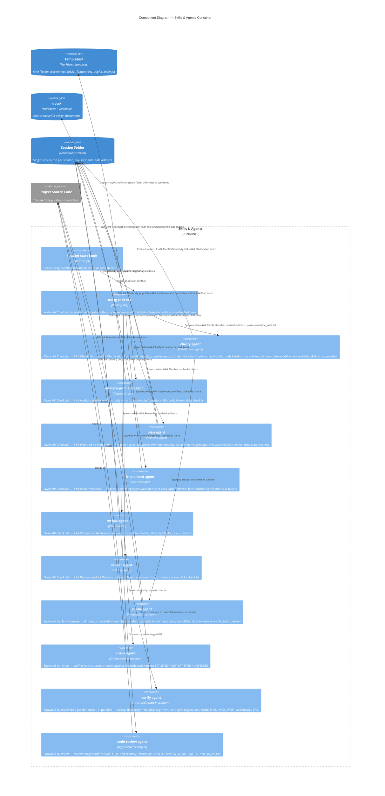

# cadence Plugin — Components

> **Type**: C4 Component
> **Last Updated**: 2026-05-09
> **Covers**: Internal components of the Skills & Agents container

## Diagram

## Key Decisions

- `using-cadence` is the single entry point — all routing decisions live here, not in individual agents
- Workflow state lives in `session.md`: a single `## CheckList` section groups every workflow item under `### <Sub-section>` headings (one per agent); body sections (`## Clarification`, `## Plan`, `## Analysis`, `## Review`, `## Delivery`) hold the structured content with `<!-- TODO: ... -->` placeholders. Routing walks `## CheckList` top-to-bottom and spawns the owner of the first sub-section with any `- [ ]` item — this enables resume after interruption (from plan: cadence-template-driven-checklists, cadence-checklist-collapse)
- Each phase agent owns one `### <Sub-section>` under `## CheckList` (and, where applicable, the matching `## <Section>` body); its sole output is editing those (filling `<!-- TODO: ... -->` placeholders and ticking checklist items) — there are no per-phase md files (from plan: cadence-template-driven-checklists, cadence-checklist-collapse)
- Subagents return one-line handoffs pointing at `session.md` and summarising the work; the file is the contract, the return message is the pointer (from plan: cadence-template-driven-checklists)

## Notes

- See `c4-containers.md` for the container-level view
- See `c4-seq-execution.md` for the runtime interaction sequence
- `hooks/run-hook.cmd` and `hooks/hooks.json` wire the SessionStart hook into Claude Code
