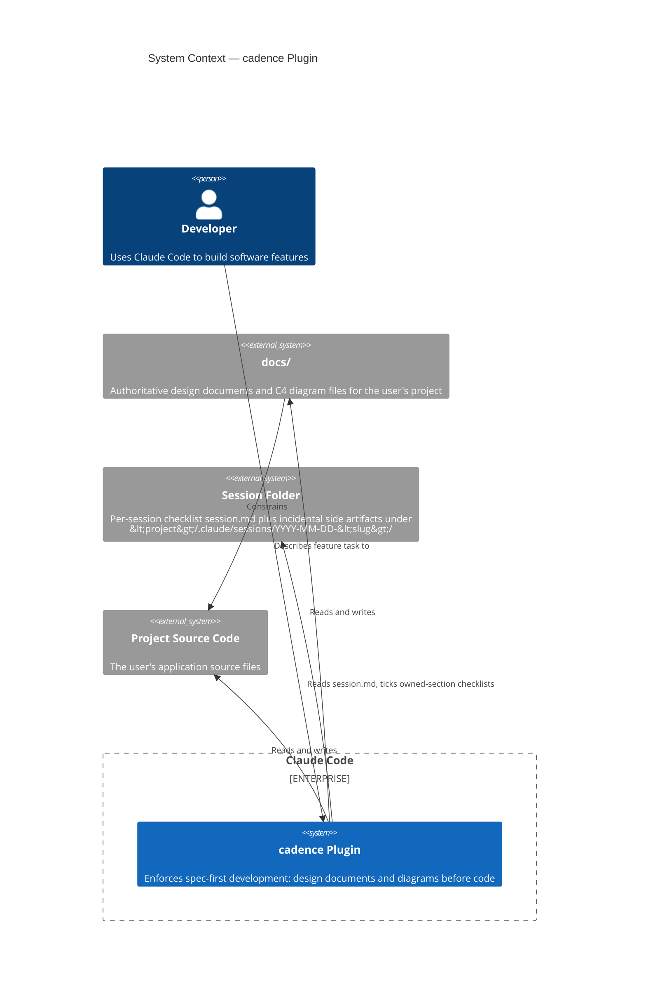

# cadence Plugin — System Context

> **Type**: C4 Context
> **Last Updated**: 2026-05-04
> **Covers**: System boundary and external actors for the Cadence Claude Code plugin

## Diagram

## Key Decisions

- The plugin has no runtime server — it is a set of instruction files interpreted by Claude Code
- `docs/` is the authoritative source of truth; code must conform to documents and diagrams, not the reverse
- The plugin operates on the user's project directory, not on its own source
- Per-session state lives in a single `session.md` checklist inside the user's project at `<project>/.claude/sessions/YYYY-MM-DD-<slug>/`; incidental side artifacts may sit alongside it (from plan: cadence-template-driven-checklists)

## Notes

- See `c4-containers.md` for the internal decomposition of the cadence plugin
- See `c4-seq-execution.md` for the end-to-end skill execution flow
