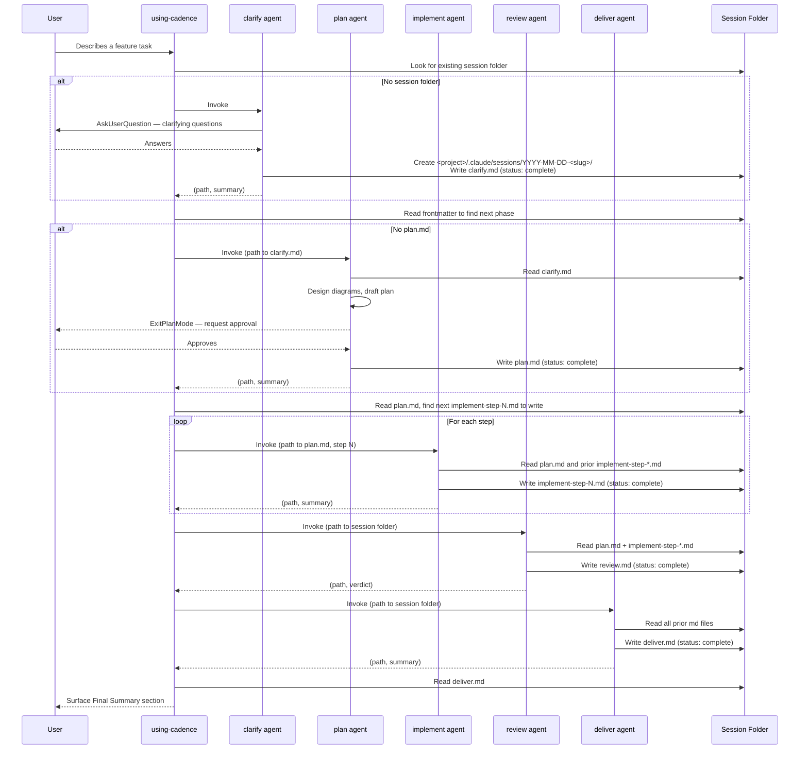

# cadence Skill Execution Flow

> **Type**: Sequence
> **Last Updated**: 2026-05-03
> **Covers**: End-to-end flow from user describing a feature to delivery, driven by per-session folder file handoffs

## Diagram

## Key Decisions

- Each phase reads prior md files from the session folder and writes its own md file; subagent returns are one-line `(path, summary)` handoffs (from plan: cadence-session-folders)
- Resume is detection: a fresh session reads the folder, identifies the latest written phase by frontmatter `status`, and continues from the next step (from plan: cadence-session-folders)
- `plan` agent uses `EnterPlanMode`/`ExitPlanMode` as the user approval gate — no code is written until the user approves
- `review` runs the full test suite as part of end-to-end acceptance
- Implement is invoked once per step; resume identifies the last completed step from the highest-N `implement-step-*.md` with `status: complete` (from plan: cadence-session-folders)

## Notes

- Cross-reference: `c4-component-plugin.md` shows which files implement each component in this sequence
- Cross-reference: `c4-containers.md` shows the container-level structure these components belong to
- SessionStart hook injects Cadence routing guidance at the start of each session
