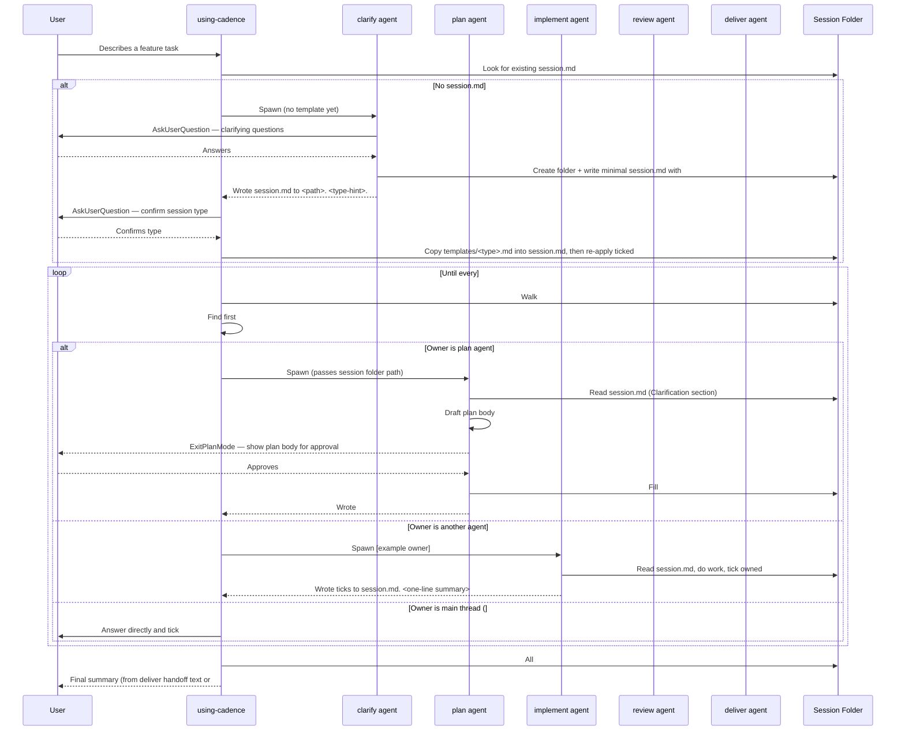

# cadence Skill Execution Flow

> **Type**: Sequence
> **Last Updated**: 2026-05-04
> **Covers**: End-to-end flow from user describing a feature to delivery, driven by checklists in a single `session.md` per session

## Diagram

## Key Decisions

- Each phase agent owns one `### <Sub-section>` under `## CheckList` and (where applicable) the matching `## <Section>` body; the agent ticks checklist items in place and replaces `<!-- TODO: ... -->` placeholders; subagent returns are one-line handoffs pointing at `session.md` (from plan: cadence-template-driven-checklists, cadence-checklist-collapse)
- Resume is detection: a fresh session reads `session.md`, walks `## CheckList` top-to-bottom, finds the first `### <Sub-section>` with any `- [ ]` item, and spawns its owner per the sub-section→owner mapping (from plan: cadence-template-driven-checklists, cadence-checklist-collapse)
- `plan` agent uses `EnterPlanMode`/`ExitPlanMode` as the user approval gate; the body shown to the user is the same body written into `## Plan` of `session.md` — code only changes after approval (from plan: cadence-template-driven-checklists)
- `review` runs the full test suite as part of end-to-end acceptance
- Implement is invoked once per `- [ ]` item under `## CheckList` → `### Implementation`; resume identifies the next step from the first remaining unchecked item (from plan: cadence-template-driven-checklists, cadence-checklist-collapse)
- After clarify returns, the routing skill calls `AskUserQuestion` to confirm session type and copies the matching template into `session.md` before spawning the next agent (from plan: cadence-template-driven-checklists)

## Notes

- Cross-reference: `c4-component-plugin.md` shows which files implement each component in this sequence
- Cross-reference: `c4-containers.md` shows the container-level structure these components belong to
- SessionStart hook injects Cadence routing guidance at the start of each session
