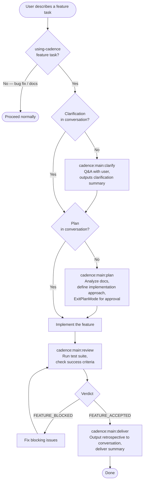

# cadence Skill Execution Flow

> **Type**: Flow
> **Last Updated**: 2026-04-19
> **Covers**: End-to-end flow from user describing a feature to delivery

## Diagram

## Key Decisions

- Clarification and plan both live in conversation context — Cadence is session-scoped
- `cadence:main:plan` uses `EnterPlanMode`/`ExitPlanMode` as the user approval gate
- `cadence:main:review` runs the full test suite as part of end-to-end acceptance
- Deviations discovered during implementation are recorded in the conversation rather than silently modifying diagrams

## Notes

- Cross-reference: `arch-modules.md` shows which files implement each step
- SessionStart hook injects Cadence routing guidance at the start of each session
