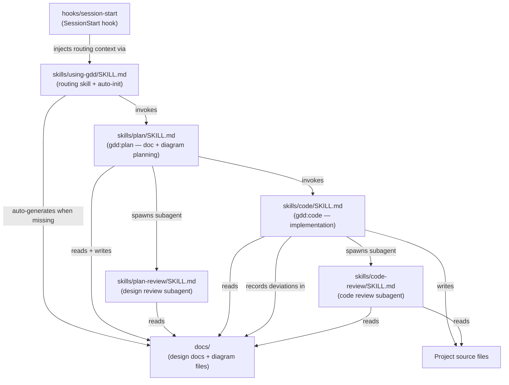

# GDD Plugin — Module Architecture

> **Type**: Architecture
> **Last Updated**: 2026-04-16
> **Covers**: Internal component layout of the GDD plugin and their dependencies

## Diagram

## Key Decisions

- Skills are instruction files, not executable code — Claude interprets them at runtime
- `using-gdd` skill is the single entry point — it detects feature tasks, auto-initializes `docs/` if missing, and invokes the appropriate skill automatically
- No slash commands exist — the entire workflow runs via skills
- `skills/plan/SKILL.md` writes both design documents (`doc-*.md`) and diagram files; `skills/code/SKILL.md` never writes either (except deviation records)
- Review skills (`plan-review`, `code-review`) are read-only subagents — they never write files
- Dependency direction: code depends on documents and diagrams; documents and diagrams do not depend on code

## Notes

- Dependency direction: arrows point from dependent to dependency
- `hooks/run-hook.cmd` and `hooks/hooks.json` wire the SessionStart hook into Claude Code
- Plugin metadata lives in `.claude-plugin/` (not shown — not part of the GDD workflow)
