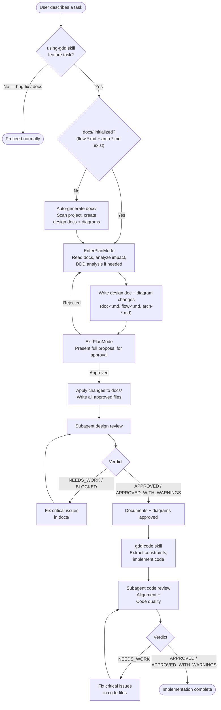

# GDD Skill Execution Flow

> **Type**: Flow
> **Last Updated**: 2026-04-16
> **Covers**: End-to-end flow from user describing a task to documents, diagrams, and code being approved

## Diagram

## Key Decisions

- The `using-gdd` skill is the single entry point — it detects feature tasks and drives the entire workflow automatically
- When `docs/` is missing, the agent auto-generates it (no user action required)
- Design documents (`doc-*.md`) are written first, then diagrams are updated to reflect the design
- Both plan and code phases use a subagent fix-and-retry loop to self-heal critical issues
- Bug fixes and non-feature tasks are caught early by `using-gdd` and bypass the GDD flow entirely
- Deviations discovered during coding are recorded in `docs/drafts/` rather than silently applied
- There are no slash commands — all steps are executed as skills

## Notes

- Cross-reference: `arch-modules.md` shows which files implement each step
- The `using-gdd` skill handles routing logic and invokes `gdd:plan` automatically for feature tasks
- SessionStart hook injects GDD routing guidance at the start of each session
