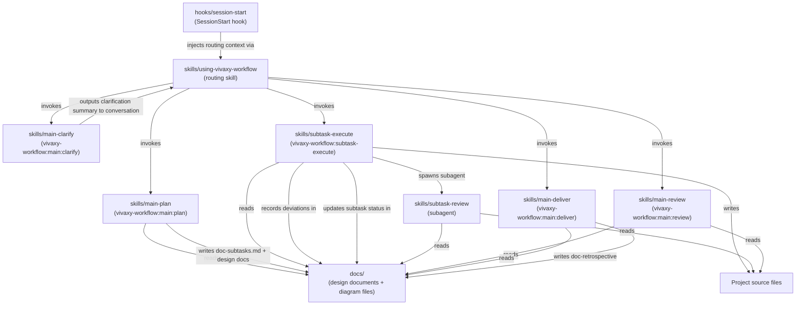

# vivaxy-workflow Plugin — Module Architecture

> **Type**: Architecture
> **Last Updated**: 2026-04-18
> **Covers**: Internal component layout of the vivaxy-workflow plugin and their dependencies

## Diagram

## Key Decisions

- Skills are instruction files, not executable code — Claude interprets them at runtime
- `using-vivaxy-workflow` is the single entry point — it detects feature tasks and routes to the correct phase automatically
- `vivaxy-workflow:subtask-execute` never modifies `flow-*.md` or `arch-*.md` — deviations are recorded in `docs/drafts/`
- `vivaxy-workflow:subtask-review` is a read-only subagent — it never writes files
- Workflow state is persisted in `docs/doc-subtasks.md` — resumable across sessions

## Notes

- `hooks/run-hook.cmd` and `hooks/hooks.json` wire the SessionStart hook into Claude Code
- Plugin metadata lives in `.claude-plugin/` (not shown — not part of the vivaxy Workflow workflow)
